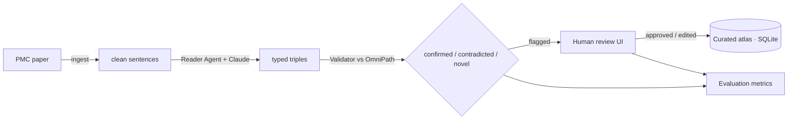

# kinase-extract

A scaled-down, **learning-focused multi-agent LLM pipeline** that reads
biomedical papers, extracts **kinase → substrate → phosphosite** relationships,
cross-validates them against a real curated database, surfaces the uncertain
ones for human review, and evaluates itself.

Inspired by the PhosphoAtlas++ project (UCSF Radiation Oncology) and focused on
one biology: **BRAF / MEK / ERK signaling in colorectal cancer**. It is built to
demonstrate the core ideas of applied AI engineering end-to-end — structured
output extraction, tool-grounded validation, human-in-the-loop review, a
curated data store, and honest evaluation — not to be a production system.

> **License:** MIT · **Status:** complete learning project (no cloud deployment)

## Pipeline



Two runtime shapes, kept deliberately separate: an **offline batch pipeline**
(ingest → reader → validator → evaluate) and an **interactive review app**
(Streamlit). All reasoning/data logic lives in the `pipeline/` package; `app.py`
is a thin UI layer.

## Concepts demonstrated

| Component | Files | Concept |
|---|---|---|
| Ingestion | `pipeline/ingest.py` | Real-world text ingestion; **cache-first** design; handling external-API failure modes |
| Reader Agent | `pipeline/reader.py`, `pipeline/schema.py` | **Structured output extraction** (Pydantic schema as a contract); **provider abstraction** (Claude / local Ollama / mock backends) |
| Validator Agent | `pipeline/validator.py`, `pipeline/normalize.py` | **Tool grounding** against a curated DB; **entity normalization** (gene-symbol + family resolution) |
| Review UI | `app.py`, `pipeline/review.py` | **Human-in-the-loop**; capturing human decisions as gold labels |
| Curated atlas | `pipeline/curation.py` | **Two-database architecture**: read-only reference vs. writable curation store |
| Evaluation | `pipeline/evaluate.py` | **Eval design**: what a metric does and does *not* measure; closing the loop |

## Quickstart

```bash
pip install -r requirements.txt
```

**30 seconds, no API key, no network** — runs the whole batch pipeline on a
bundled synthetic paper using the offline mock backend and fixture database:

```bash
BACKEND=mock REFERENCE=fixture ./run_pipeline.sh PMC_SAMPLE
python -m pipeline.evaluate PMC_SAMPLE
```

**Real run** — needs an [Anthropic API key](https://console.anthropic.com/) and
internet access (for PubMed Central + OmniPath):

```bash
cp .env.example .env            # then paste your key into .env
./run_pipeline.sh PMC6582307 PMC7694028 PMC10779188 PMC9456575
streamlit run app.py            # review flagged triples, Save
python -m pipeline.evaluate --all
```

Re-run only the validator over already-fetched papers (no re-extraction, **no
API cost**):

```bash
./revalidate.sh
```

## The components

- **`ingest.py`** — fetches a PMC open-access paper's full text from Europe PMC
  (cache-first to `data/raw/`), parses the JATS XML, and splits it into evidence
  sentences. Ships a synthetic sample so everything runs offline.
- **`schema.py`** — the Pydantic models. `KinaseTriple` / `Extraction` are the
  extraction contract; `ValidatedTriple`, `ReviewedTriple`, etc. carry results
  downstream.
- **`reader.py`** — the Reader Agent. One `ReaderBackend` interface, three
  implementations: `claude` (hosted, `messages.parse` enforces the schema),
  `ollama` (local open weights), `mock` (canned, offline).
- **`normalize.py`** — entity normalization: protein names → HGNC gene symbols,
  family names (MEK/ERK/RAF) → their gene-symbol sets, and written sites
  (`Ser218 and Ser222`) → database form (`[S218, S222]`).
- **`validator.py`** — the Validator Agent: looks each triple up in OmniPath's
  enzyme–substrate data (or an offline CSV fixture) and labels it
  **confirmed / contradicted / novel**, with an optional site-level match.
- **`review.py` + `app.py`** — the human-in-the-loop layer: a Streamlit app that
  shows each flagged triple with its evidence and records approve/reject/edit.
- **`curation.py`** — the curated atlas: a local SQLite DB that accumulates the
  human-endorsed findings with provenance.
- **`evaluate.py`** — computes DB agreement, site accuracy, review outcomes,
  flag precision, and pipeline yield — per paper or pooled (`--all`).

## Example output

Validator (one triple):

```
  OK [confirmed   ] MEK->ERK1 (MAP2K1->MAPK3)  [extractor: high]
       verdict : OmniPath records MAP2K1 -> MAPK3 phosphorylation. All site(s) T202/Y204 match the record.
       evidence: RAF proteins further phosphorylate and activate MEK 1/2 on serines 218 and 222, which in turn lead to phosphorylation and activation of ERK1 on threonine 202 and tyrosine 204 ...
```

Aggregate evaluation over 5 papers:

```
Triples extracted        : 28
  confirmed / contradicted / novel : 22 / 2 / 4
DB agreement rate        : 78.6%
Site accuracy            : 100.0%  (pooled over 4 sited confirmed triples)
```

## Evaluation case study: the eval that fixed the pipeline

The evaluation didn't just score the system — it pointed at the next fix. An
early run over real papers showed a **32% DB agreement rate**. Inspecting the
`novel` bucket revealed the cause: most were *not* new biology but
**normalization failures** — family names like "MEK", "RAF proteins", and
"MEK 1/2" that the thin alias map couldn't resolve to gene symbols.

Making normalization **family-aware** (expanding `MEK → {MAP2K1, MAP2K2}`, etc.)
and parsing multi-site strings, then **re-validating the cached extractions**
(no re-extraction cost), moved the numbers:

| | Before | After |
|---|---|---|
| Confirmed triples | 9 | **22** |
| Novel triples | 17 | **4** |
| DB agreement rate | 32.1% | **78.6%** |

*Measure → find the bottleneck → fix one thing → re-measure* — the eval loop,
closed.

## Design decisions & their honest limits

- **`novel` and `contradicted` are heuristics, not verdicts.** Curated databases
  store *positives* only, so absence ≠ falsehood. "Novel" means "absent from
  OmniPath"; "contradicted" means "only the reverse direction is curated". Both
  are *flags for a human*, not automatic rejections.
- **The evidence sentence is kept end-to-end** so a reviewer can tell a faithful
  extraction that disagrees with the DB from an actual extraction error.
- **Normalization is a curated map, not a full resolver.** Transparent and
  testable, but production would normalize against HGNC/UniProt.
- **The eval is small and single-annotator.** Recall is unmeasured (it needs an
  exhaustively labeled gold set). The site check is **strict** — every named site
  must be recorded to count as a match — so site accuracy is a conservative
  residue-level precision spot-check.

## Future work

- Deployment (Docker → Hugging Face Spaces) for a live demo.
- Fine-tuning a small open model on the accumulated human-reviewed labels.
- Richer normalization via a real HGNC/UniProt resolver; family-aware site logic.
- Multi-annotator review and inter-annotator agreement.

## Repository layout

```
pipeline/         offline pipeline package (ingest, reader, validator, review, curation, evaluate)
app.py            Streamlit human-in-the-loop review UI
run_pipeline.sh   batch driver: ingest -> reader -> validator -> aggregate eval
revalidate.sh     re-validate cached extractions only (no API cost)
data/             cached papers, extractions, validations, reviews, the curated atlas, and fixtures
```

## License

MIT — see [LICENSE](LICENSE).
